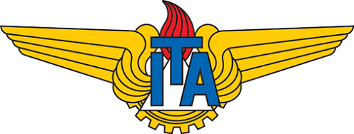

# Boas Vindas


ivo: Queremos ajudar as equipes a trabalhar de forma mais eficiente com uma documentação simples, mas poderosa, que as ajude a compartilhar seu conhecimento.


Organizações que contribuíram com esse projeto:

<table data-view="cards"><thead><tr><th></th><th></th></tr></thead><tbody><tr><td></td><td></td></tr><tr><td></td><td></td></tr><tr><td></td><td></td></tr></tbody></table>

